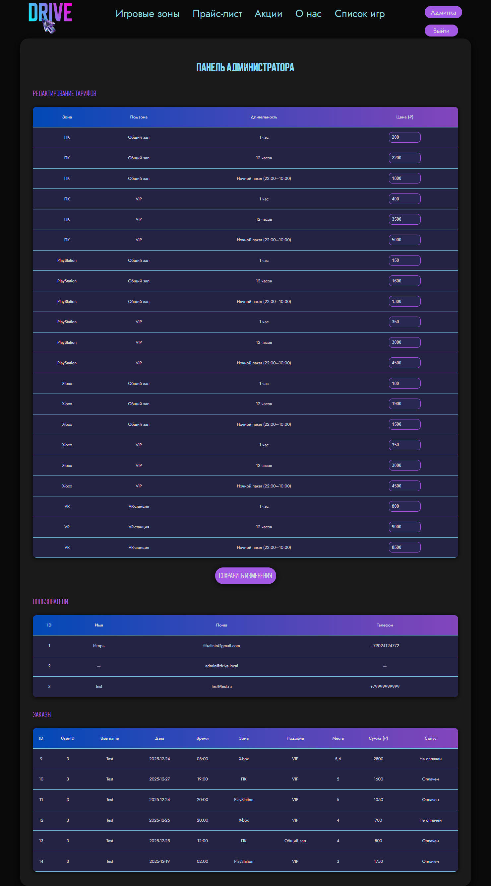
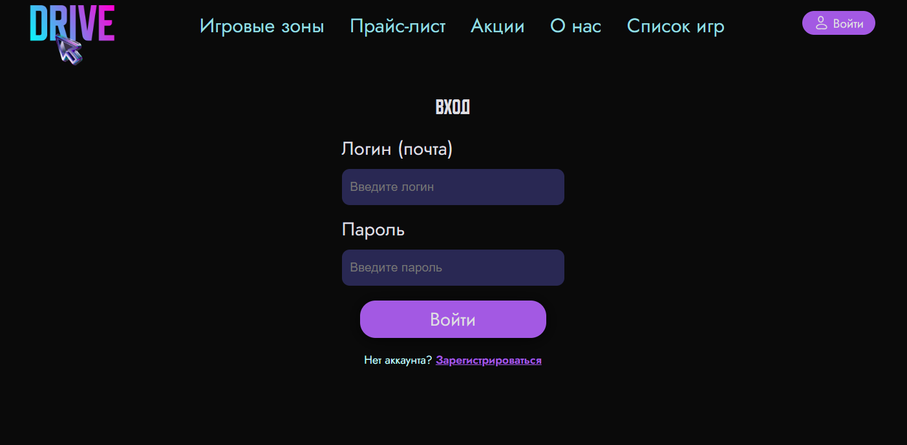

# DRIVE — система онлайн-бронирования компьютерного клуба

Веб-приложение на Flask для записи клиентов в компьютерный клуб:  выбор зоны (PC, PlayStation, Xbox, VR),  
времени и длительности сеанса, конкретных мест, способа оплаты и просмотр истории заказов.

## Основные возможности

- Регистрация и авторизация пользователей с проверкой пароля.
- Бронирование игровых мест с выбором зоны, подзоны, времени, длительности и мест.
- Автоматический расчет стоимости с учетом тарифов и накопленной скидки.
- Личный кабинет с историей заказов и редактированием контактных данных.
- Админ-панель для управления тарифами и просмотра всех пользователей и заказов 

## Технологии

- Backend: Python, Flask, Jinja2.  
- Frontend: HTML, CSS, JavaScript.  
- База данных: SQLite  

## Как запустить локально

git clone https://github.com/username/drive-club.git  
cd ./drive  
python -m venv venv  
source venv/bin/activate # Windows: venv\Scripts\activate  
pip install -r requirements.txt  
python initdb.py  
python app.py  

Приложение будет доступно по адресу `http://127.0.0.1:5001/`

## Скриншоты

## Автор

Учебный проект для автоматизации работы компьютерного клуба.  
Разработка: Калинин Игорь  
Дизайн: Пожидаева Каталина
